<div align="center">

# 💬 Real-Time MERN Chat Application on AWS ECS Fargate

**A production-style, containerized real-time chat platform — built with the MERN stack, deployed cloud-natively on AWS.**

[](https://react.dev/)
[](https://nodejs.org/)
[](https://expressjs.com/)
[](https://www.mongodb.com/)
[](https://socket.io/)
[](https://www.docker.com/)
[](https://aws.amazon.com/ecs/)
[](https://www.nginx.com/)
[](https://developer.mozilla.org/en-US/docs/Web/JavaScript)
[](#-license)

</div>

---

## 📖 Table of Contents

- [Overview](#-overview)
- [Tech Stack](#-tech-stack)
- [Architecture](#-architecture)
- [Features](#-features)
- [Folder Structure](#-folder-structure)
- [Deployment Guide](#-deployment-guide)
- [Environment Variables](#-environment-variables)
- [Docker](#-docker)
- [Screenshots](#-screenshots)
- [Challenges Faced](#-challenges-faced)
- [Future Improvements](#-future-improvements)
- [License](#-license)
- [Author](#-author)

---

## 🧭 Overview

This repository contains a **real-time one-to-one chat application** built on the **MERN stack** (MongoDB, Express.js, React.js, Node.js), engineered as a **cloud-native, containerized deployment** rather than a simple local dev-server project.

Both the **client** and the **server** are packaged as independent Docker images and deployed as two separate services on **Amazon ECS Fargate** — a serverless container orchestration platform that removes the need to provision or manage EC2 instances. The frontend is served through an **Nginx** production build, the backend exposes a REST + WebSocket API via **Express** and **Socket.IO**, and persistent data is stored in **MongoDB**.

> This is not a tutorial clone — every screenshot in this README was captured from a live deployment running under this repository's own AWS account, ECR repositories, and ECS cluster.

---

## 🛠 Tech Stack

| Frontend | Backend | Database | Cloud & DevOps |
|---|---|---|---|
| React.js | Node.js | MongoDB | Amazon ECS (Fargate) |
| Styled Components | Express.js | | Amazon ECR |
| Axios | Socket.IO | | AWS CloudWatch |
| Socket.IO Client | JWT Authentication | | AWS Security Groups |
| | Mongoose | | Docker (multi-stage builds) |
| | | | Nginx |

---

## 🏗 Architecture

### Application Runtime Architecture

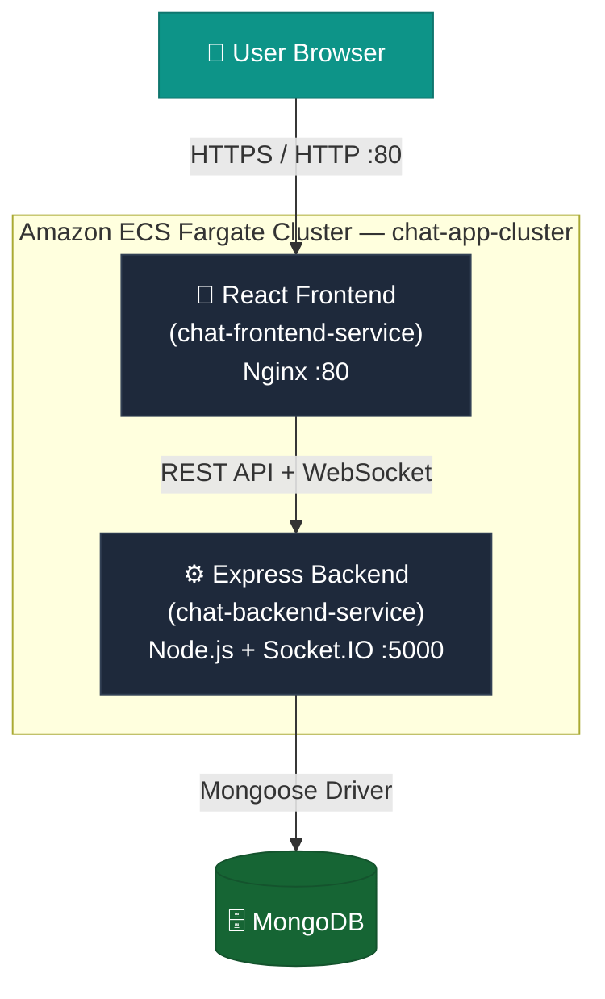

### CI/Deployment Pipeline

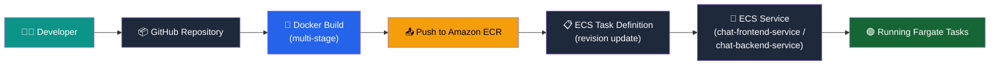

---

## ✨ Features

| Category | Feature |
|---|---|
| 🔐 Auth | User Registration & Login |
| 🔐 Auth | JWT-based Session Authentication |
| 🖼️ Profile | Custom Avatar Upload |
| 👥 Contacts | Contact List / Conversation Sidebar |
| 💬 Messaging | One-to-One Real-Time Messaging |
| ⚡ Real-Time | Socket.IO powered live message delivery |
| 📱 UI/UX | Fully Responsive Design |
| 🐳 Containerization | Dockerized Frontend (Nginx production build) |
| 🐳 Containerization | Dockerized Backend (Node/Express) |
| ☁️ Cloud | Deployed on AWS ECS Fargate (serverless containers) |

---

## 📂 Folder Structure

```
real_chat_app_devops/
├── client/                        # React frontend
│   ├── public/
│   ├── src/
│   │   ├── assets/
│   │   ├── components/
│   │   │   ├── ChatContainer.jsx
│   │   │   ├── ChatInput.jsx
│   │   │   ├── Contacts.jsx
│   │   │   ├── Logout.jsx
│   │   │   └── NoSelectedContact.jsx
│   │   ├── configs/
│   │   │   └── envVariables.js
│   │   ├── pages/
│   │   │   ├── Chat.jsx
│   │   │   ├── Login.jsx
│   │   │   ├── Register.jsx
│   │   │   └── SetProfileImage.jsx
│   │   └── utils/
│   ├── Dockerfile                 # Multi-stage build → Nginx
│   ├── nginx.conf
│   └── package.json
│
├── server/                        # Express + Socket.IO backend
│   ├── controllers/
│   ├── models/
│   ├── routes/
│   ├── socket.js
│   ├── Dockerfile
│   └── package.json
│
├── README-assets/                 # Screenshots used in this README
├── docker-compose.yml             # Local multi-container orchestration
└── README.md
```

---

## 🚀 Deployment Guide

<details>
<summary><strong>Click to expand full deployment walkthrough</strong></summary>

### 1️⃣ Clone the Repository

```bash
git clone https://github.com/tejas1121/real_chat_app_devops.git
cd real_chat_app_devops
```

### 2️⃣ Backend Setup

```bash
cd server
npm install
# create a .env file — see Environment Variables section below
npm run dev
```

### 3️⃣ Frontend Setup

```bash
cd client
npm install
# create a .env file — see Environment Variables section below
npm start
```

### 4️⃣ Docker Build

Build production images for both services:

```bash
# Backend
cd server
docker build -t chat-backend .

# Frontend (multi-stage build, served via Nginx)
cd ../client
docker build -t chat-frontend .
```

### 5️⃣ Push Images to Amazon ECR

```bash
aws ecr get-login-password --region ap-south-1 | \
  docker login --username AWS --password-stdin <account-id>.dkr.ecr.ap-south-1.amazonaws.com

docker tag chat-backend:latest <account-id>.dkr.ecr.ap-south-1.amazonaws.com/chat-backend:latest
docker tag chat-frontend:latest <account-id>.dkr.ecr.ap-south-1.amazonaws.com/chat-frontend:latest

docker push <account-id>.dkr.ecr.ap-south-1.amazonaws.com/chat-backend:latest
docker push <account-id>.dkr.ecr.ap-south-1.amazonaws.com/chat-frontend:latest
```

### 6️⃣ Create ECS Task Definitions

Define two Fargate task definitions — `chat-backend` and `chat-frontend` — each referencing its respective ECR image URI, CPU/memory allocation, and container port mappings (`5000` for backend, `80` for frontend).

### 7️⃣ Create ECS Services

Deploy both task definitions as **ECS Services** inside a shared cluster (`chat-app-cluster`), each running as an independent Fargate service:

- `chat-backend-service`
- `chat-frontend-service`

### 8️⃣ Access the Application

Once both services report `1/1 Tasks running`, retrieve the frontend task's **public IP** (or attach a stable endpoint — see [Future Improvements](#-future-improvements)) and open it in the browser on port `3000`/`80`.

</details>

---

## 🔑 Environment Variables

> ⚠️ Templates only — never commit real credentials.

**Backend (`server/.env`)**
```env
PORT=
MONGO_URL=
JWT_SECRET=
```

**Frontend (`client/.env`)**
```env
REACT_APP_API_URL=
```

---

## 🐳 Docker

<details>
<summary><strong>Frontend Container</strong></summary>

- Multi-stage Docker build: Node.js builds the static React bundle in stage one, then a lightweight **Nginx (alpine)** image serves the compiled static assets in stage two.
- This keeps the final image small and production-ready, avoiding the React development server entirely.

</details>

<details>
<summary><strong>Backend Container</strong></summary>

- Single-stage Express server image running the Node.js runtime.
- Exposes port `5000`, connects to MongoDB via Mongoose, and hosts the Socket.IO server for real-time events.

</details>

---

## 📸 Screenshots

> Screenshots below are captured directly from the live deployment (Docker Desktop, Amazon ECR, ECS Console, CloudWatch, and the GitHub repository itself).

### Application

**Login Page**
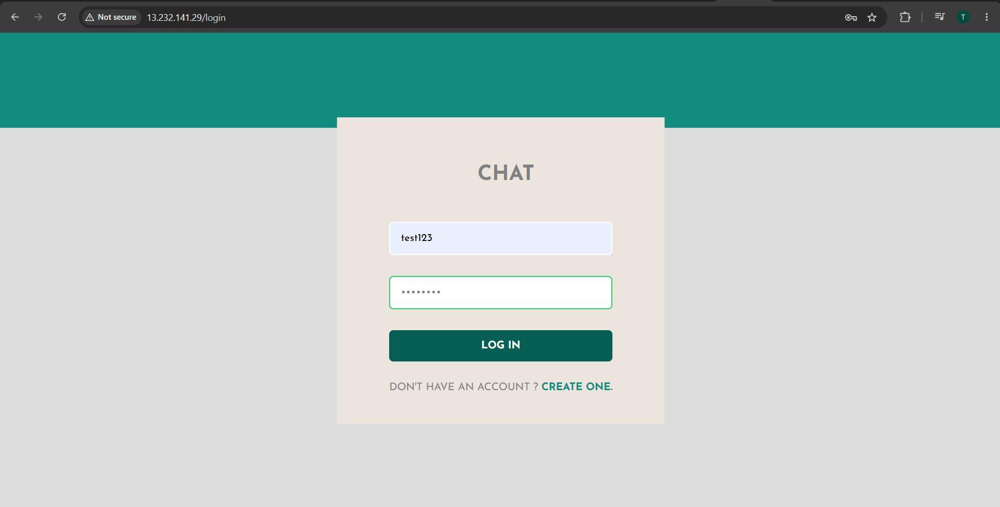


**Post-Login / Contact Selection**
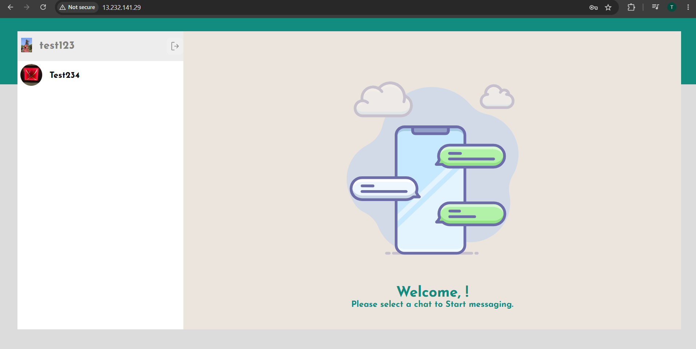

**Real-Time One-to-One Chat**
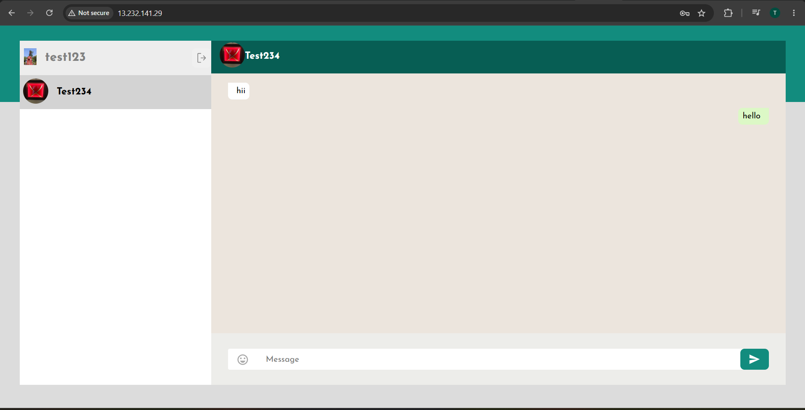

### Local Containerization

**Docker Desktop — Local Multi-Container Stack (client / server / mongo)**
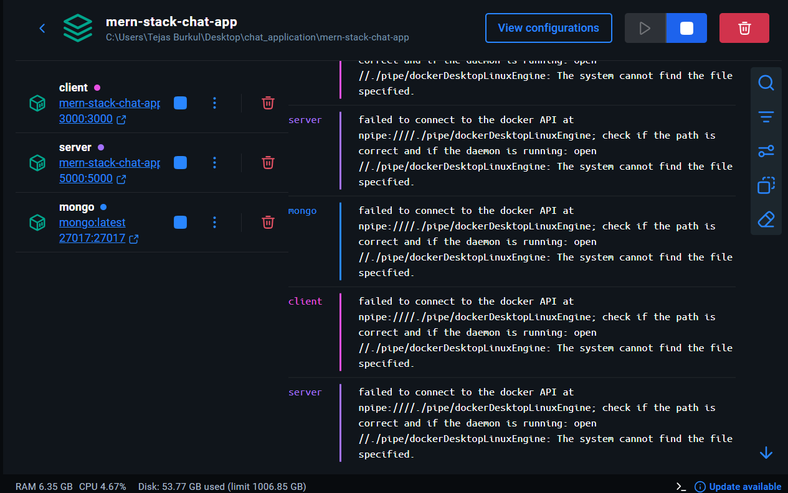

**Docker Build — Frontend Multi-Stage Build Output**
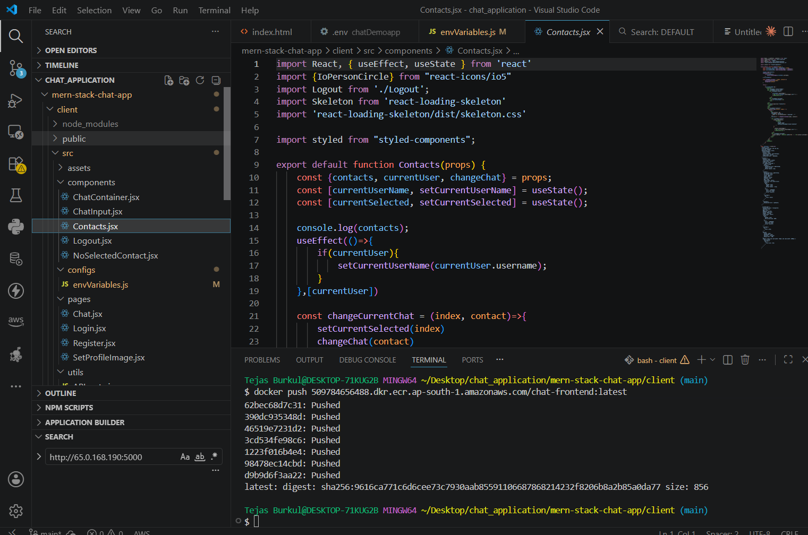

**Docker Push — Frontend Image Pushed to Amazon ECR**
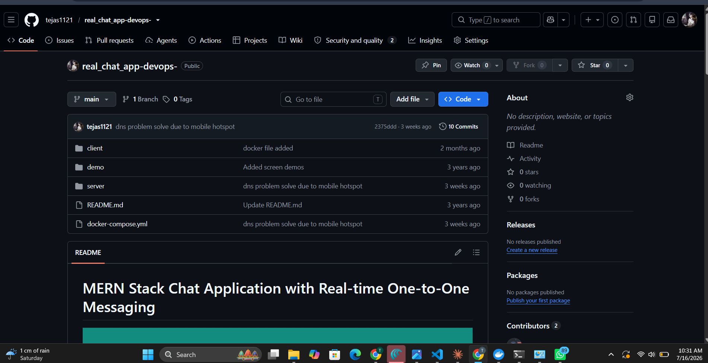

### AWS Cloud Deployment

**Amazon ECR — Private Repositories**
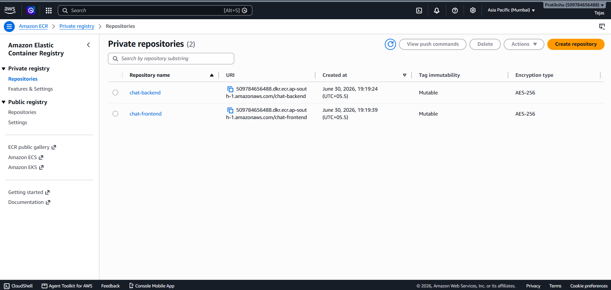

**ECS Cluster Overview — `chat-app-cluster`**
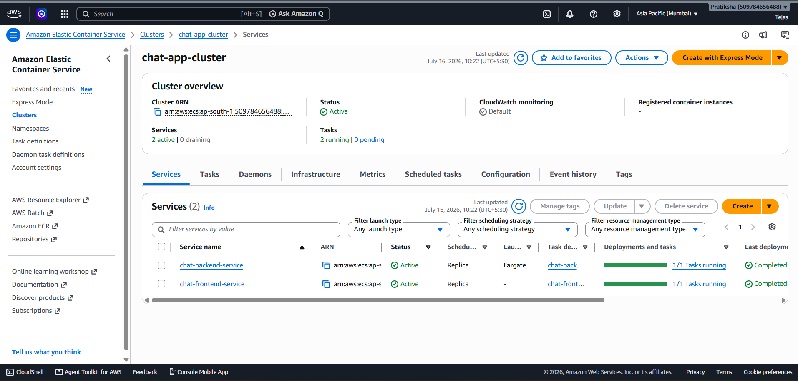

**ECS Service Health — `chat-frontend-service`**
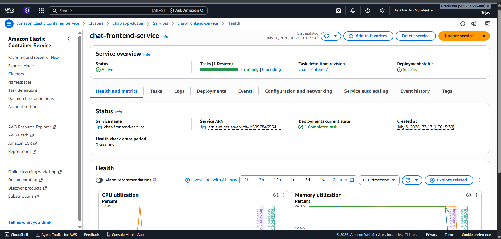

**ECS Service Health — `chat-backend-service`**
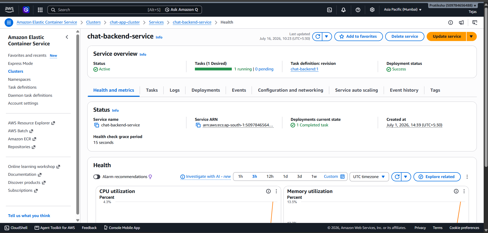

**ECS Task Definitions**
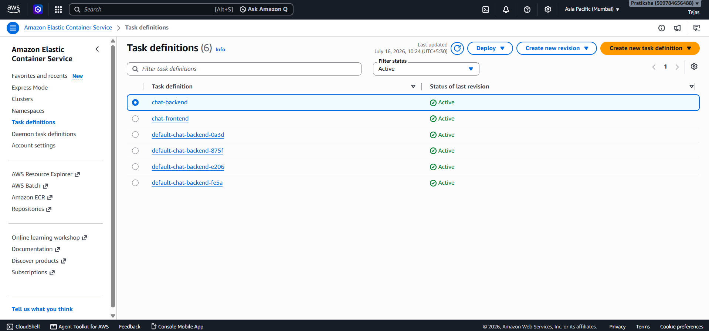

**Running Task Configuration — Backend**
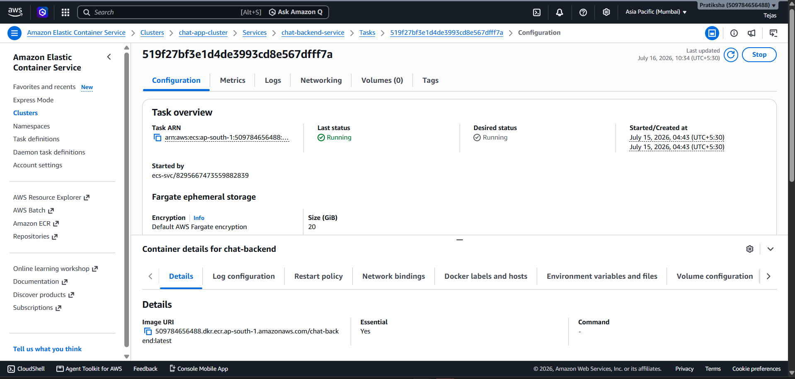

**Running Task Configuration — Frontend**
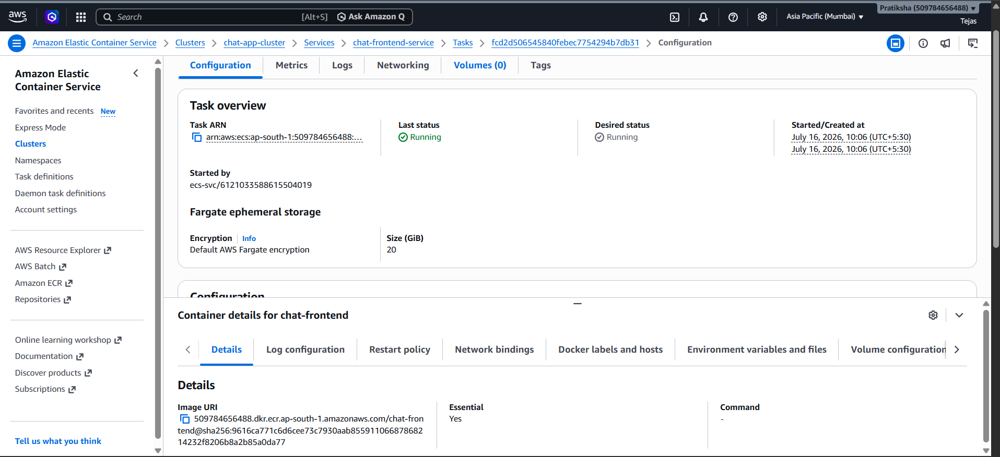

**CloudWatch Logs — Frontend Service**
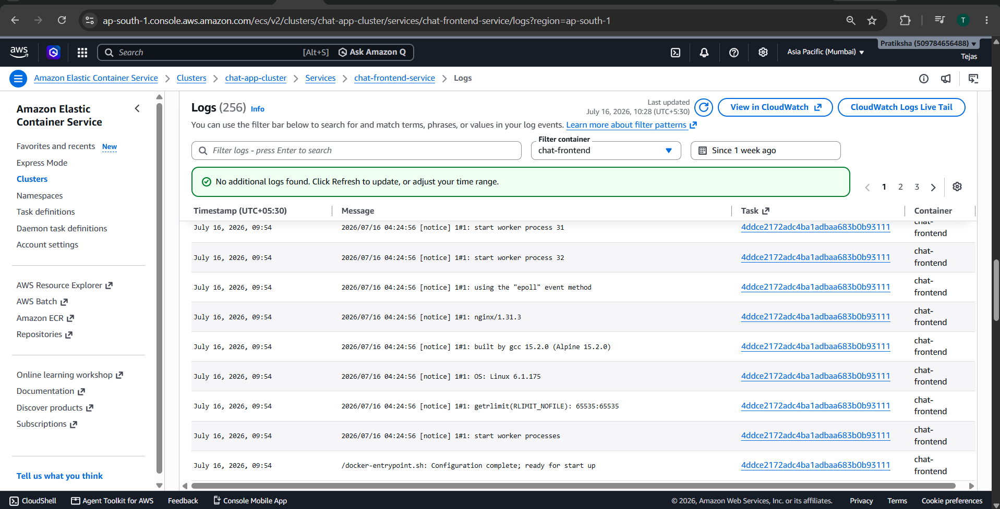

**Security Group — Inbound Rules**
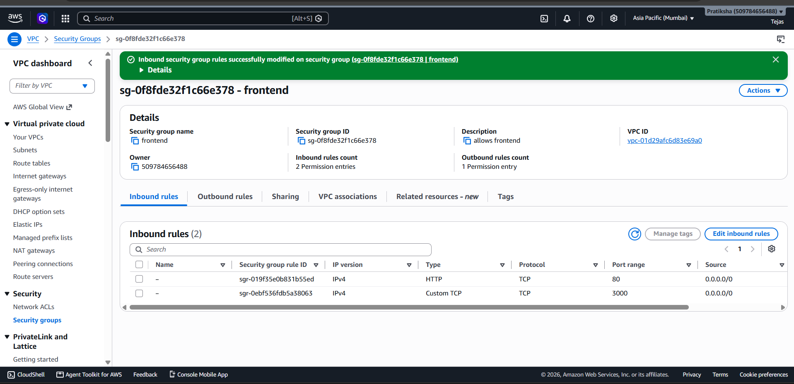

### Source Control

**GitHub Repository**
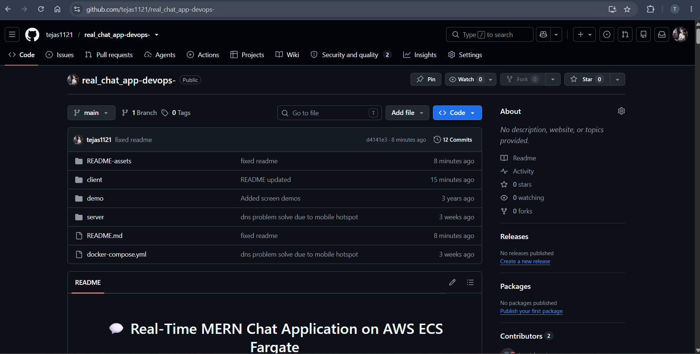

**Project Structure (VS Code)**
[Project Structure](README-assets/github-repo.png)


---

## 🧩 Challenges Faced

Real deployment challenges encountered while shipping this project to AWS ECS Fargate:

- Deploying the **frontend and backend as two independent ECS services** rather than a single monolithic container, and getting them to communicate correctly.
- Configuring **Security Groups** to allow HTTP (`80`) and application traffic (`3000`) while keeping the surface area minimal.
- **Docker image optimization** — moving from a single fat image to a multi-stage build to shrink the frontend image size.
- Migrating the React app off the **development server** and onto a production **Nginx** build for the containerized deployment.
- Managing **frontend ↔ backend communication** across two separately scheduled Fargate tasks with no fixed internal DNS.
- Handling **ECS Fargate tasks receiving new public IPs** on every redeploy, before a stable endpoint was introduced.
- Debugging **Socket.IO** behavior specifically in the containerized/cloud environment (proxying, CORS, and connection upgrades).
- Correctly scoping and injecting **environment variables** for each service without baking secrets into images.
- Resolving local **Docker Desktop networking issues** (e.g., DNS resolution failures during local multi-container testing).

---

## 🔮 Future Improvements

- [ ] **Application Load Balancer (ALB)** in front of ECS services for a stable, single entry point.
- [ ] **HTTPS** via AWS Certificate Manager (ACM).
- [ ] **Custom Domain** using Route 53.
- [ ] **CI/CD Pipeline** with GitHub Actions for automated build → push → deploy.
- [ ] **Auto Scaling** policies for ECS services based on CPU/memory thresholds.
- [ ] **Redis** for session/socket state sharing across scaled instances.
- [ ] **Push/In-app Notifications**.
- [ ] **Group Chats**.
- [ ] **File Sharing** in conversations.

---

## 📄 License

This project is licensed under the **MIT License** — see the [LICENSE](LICENSE) file for details.

---

## 👤 Author

**Tejas Burkul**

[](https://github.com/tejas1121)
[](https://www.linkedin.com/in/tejas-burkul-6302042b5/)
[](mailto:tejasburkul49@gmail.com)

---

<div align="center">

*If this project helped you understand containerized MERN deployments on AWS, consider leaving a ⭐*

</div>
